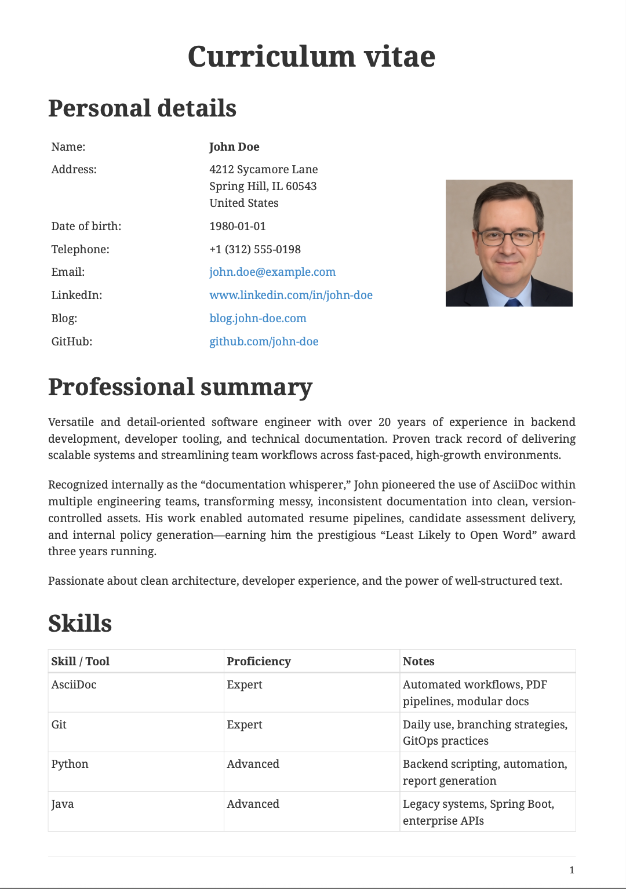
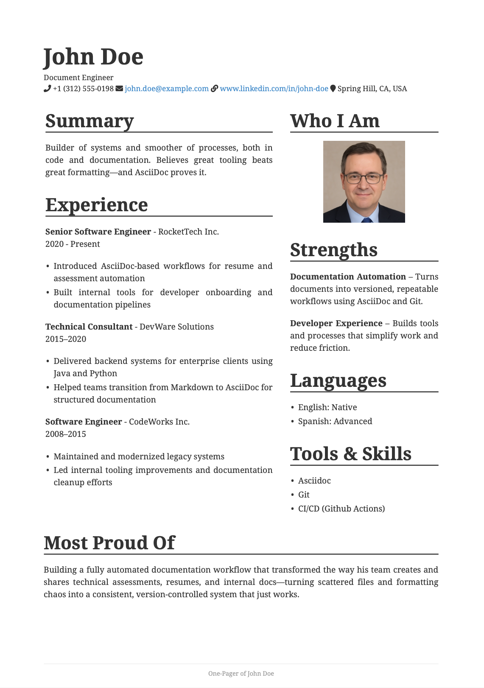

# Stop Copy-Pasting Your Resumé (and Everything Else)

A repository with AsciiDoc examples, to be used as examples in a blog post about AsciiDoc. All examples are generated with an automated GitHub Action, and published as a release. You can see the real examples at the releases page.

## Examples

### Resume 1

Simple, plain. No theming, no styling, just a siple document.

### Resume 2

A one-pager with a custom style, using columns. 

### Assessment

A multi-page document, with a cover page, a table of contents, a footer, and a custom font.

